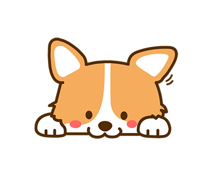

# Corgi Bot

Corgi Bot is a bot designed for the Warmachine and Hordes Virtual Team Tournament Discord Server, which has since grown to scale for additional servers. It provides role management for the server, event details, as well as basic functionality such as dice rolling and coin flips, and timers (and also some easter egg games).

Corgi.Py has been archived, as no further work on it is being completed, due to [discord.py](https://github.com/Rapptz/discord.py) being discontinued. A .Net version is being made, but this is slow, and unlikely to be any time soon. The repo is currently private, so if you want to contribute, please contact me directly.